# LQWD BTCPay Server Plugin

## install the plugin

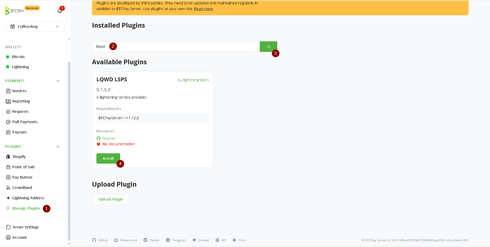

create new store if needed

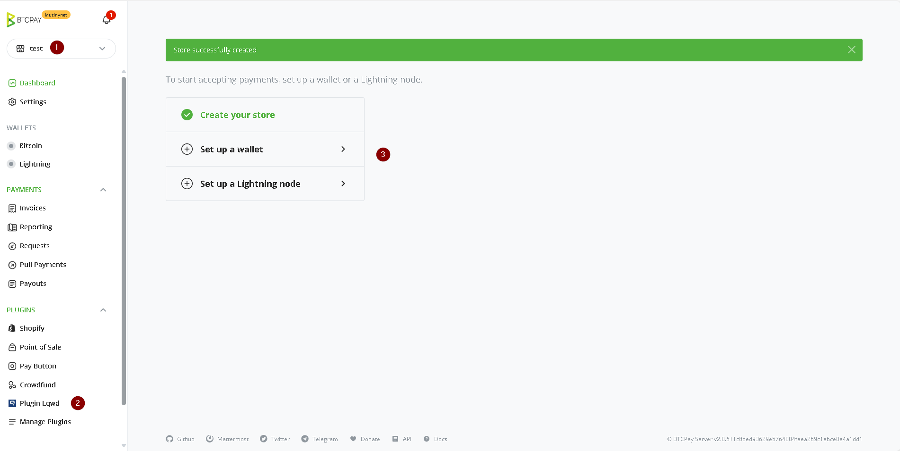

when there is no wallet set up, plugin just redirects to wallet settings page
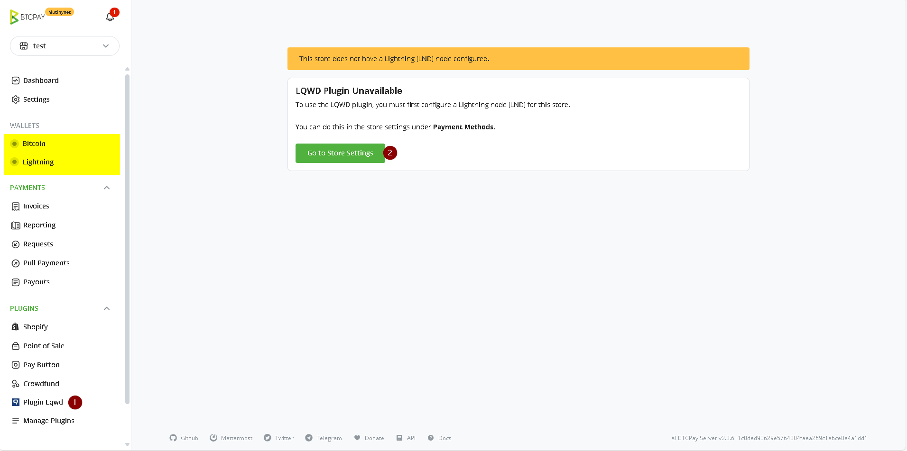

once the wallet is configured, clicking on plugin menu, will show up three submenus

1. lsps: which is the main page to connect to lsps and request liquidity
1. channels: which shows all channels to the configured lnd node (to verify the channel creation from lsps)
1. settings: which can be used to set lsps (like for mutinynet or mainnet)

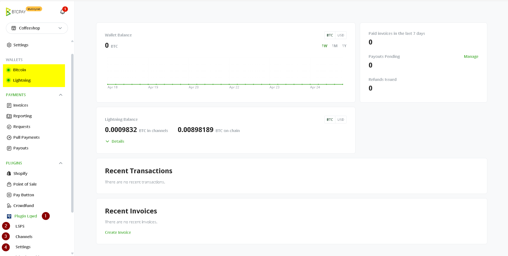

## Description of all parts

in the lsps page, 

1. click on the lsps submenu to show lsps page
2. with this button lsps info will be refreshed from the lsps server. note that it will automatically get updated when the page is openned.
3. this shows connectivity to lsps lnd node. if not connected, before making any request to lsps, your lnd node need to connect to lsps so the channel can be established
4. with this button, lnd node will connect the the active lsps lnd node
5. every 30 seconds, connectivity will be checked and if got disconnected, better to connect again so that the channel remains active and therefore can be used
6. this is the information about the lsps server. make sure your request are within the range specified in here, otherwise request will be rejected
7. this shows the time lsps info got updated
8. this is a table showing your previous requests and corresponding status.
9. in order to create new orders, click on this.    
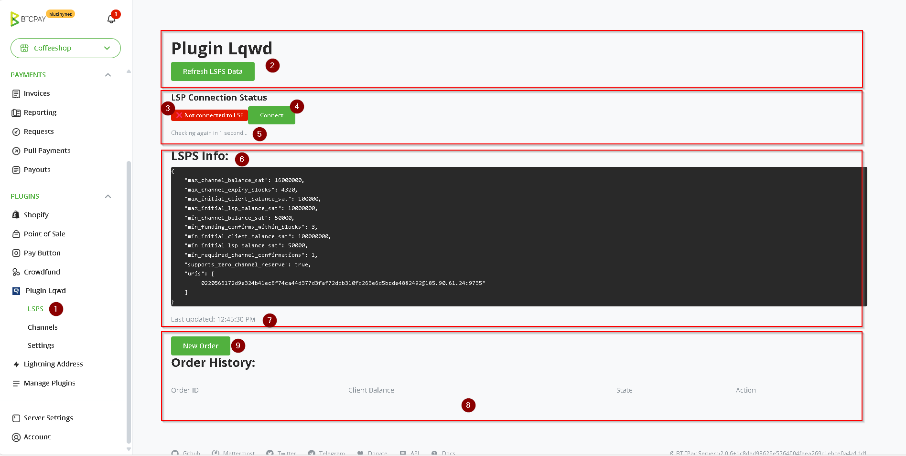

## connecting to lsps

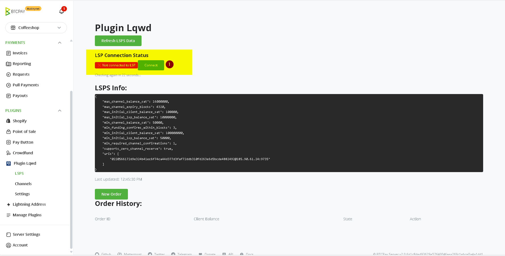
clicking on connect button, then
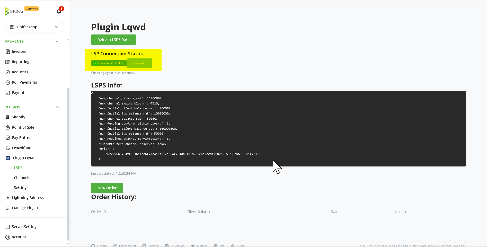

## making new order

click on new order to start
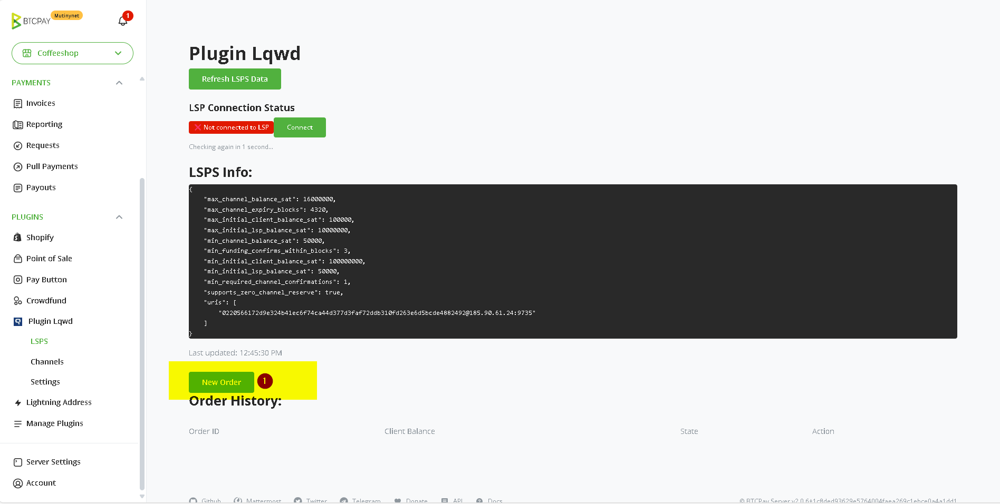
fill out these information in order to finalize order
1. the ammount wanted on your end of channel. As merchants, usually the amount needed on your side would be zero, so all channel capacity can be used for inboud transactions
2. the amount on the lsps end of the channel. this is the amount that your customers can pay to you
3. your public key, which is automatically filled in based on your lnd node info. this is the node public key to which lsps creates channel. it is very important to make sure this pubkey is what you really want
4. this is the onchain refund address, in case anything goes wrong. make sure it is what you really want. you can generate new address for your lnd node or any other address of any of your other nodes.
5. number of blocks that channel gets expired once force closed
6. optional token if there is promotion or discount so lsps treat your request differently
7. choosing wether channel will be public or private
8. channel confirmation blocks count
9. lsps fee payment confirmation blocks count 
10. after filling all data, click on submit

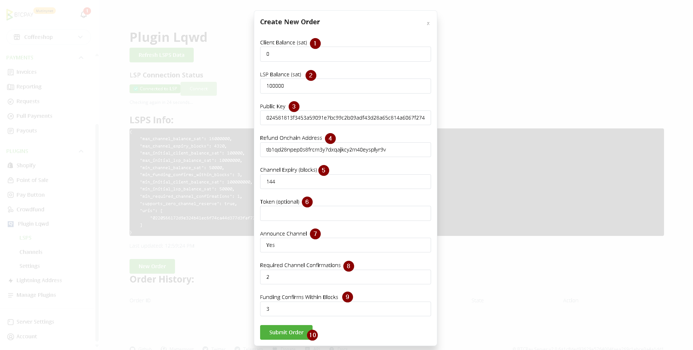

then you can see that the list of all orders are available in the highlighted section
1. you can fetch the latest status of request 
2. you can get the details of your request

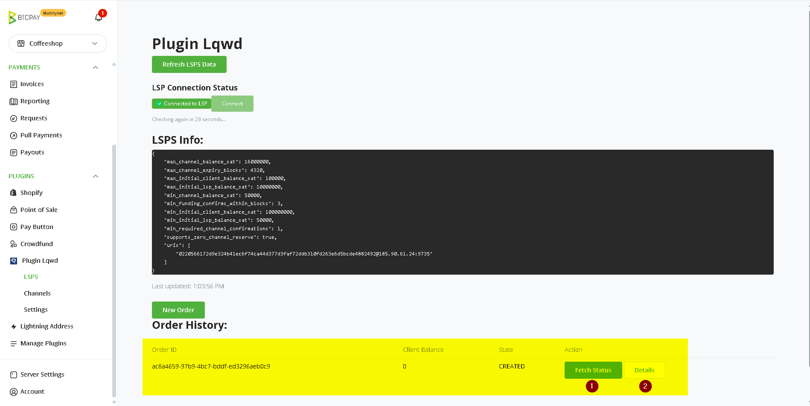

## pay the invoice
once the order is created, open the order details
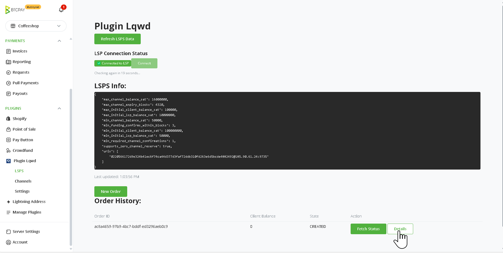

use either

1. lightning address or
2. onchain address

to pay the fees
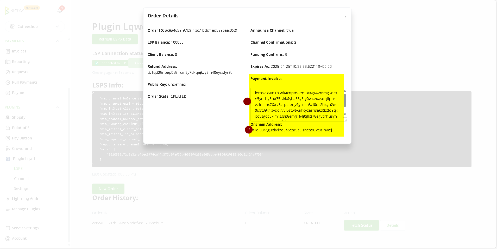
